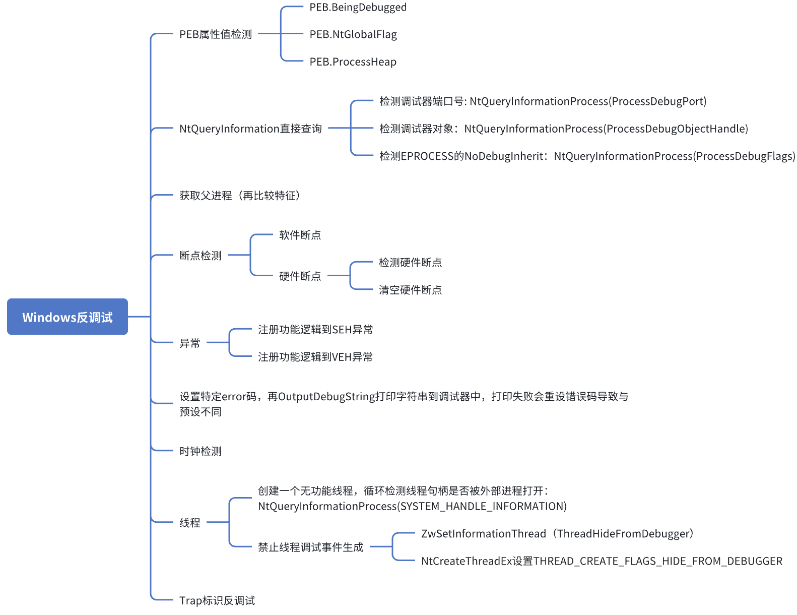

# Anti Debug

一个小型的windows反调试rust库

## anti debug list

- 检测硬件断点
- 检测peb结构体中的属性
    - NtGlobalFlag
    - BeingDebugged
    - ProcessHeap.flags
    - ProcessHeap.force_flags
- 检测调试端口
- 检测调试器内核对象是否存在
- 检测调试器标志位
- 线程
    - 设置线程禁止调试标志
    - 创建禁止调试线程
    - 创建空线程，查询系统句柄表判断是否被调试

## todo

